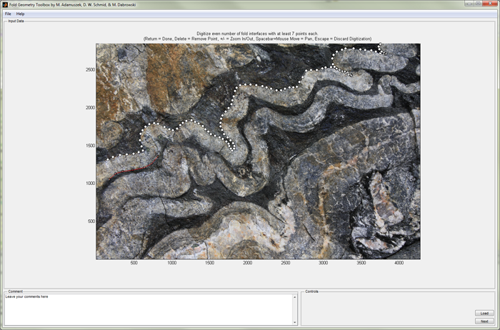

# FGT - Fold Geometry Toolbox

FGT is a tool to analyze rock fold geometry in 2D. It estimates material properties and shortening. It is developed in Matlab and compatible with Matlab versions from 2014b onwards.

The algorithms used in FGT are documented in the Journal of Structural Geology article: 
["Fold Geometry Toolbox - Automated determination of fold shape, shortening, and material properties" 
by Marta Adamuszek, Daniel Walter Schmid, and Marcin Dabrowski, doi:10.1016/j.jsg.2011.06.003](http://www.sciencedirect.com/science/article/pii/S0191814111001003) . 



### Getting Started
Download the Matlab source code as a zip, unpack on your computer, and run 
```Matlab
fgt
```

### Externals
FGT relies on the following external packages. They are included in the source, so no need to install separately.

 * [gaimc by David Gleich](https://www.mathworks.com/matlabcentral/fileexchange/24134-gaimc---graph-algorithms-in-matlab-code)
 * [GUI Layout Toolbox by David Sampson](https://www.mathworks.com/matlabcentral/fileexchange/47982-gui-layout-toolbox)
 * [mesh2d by Darren Engwirda](https://www.mathworks.com/matlabcentral/fileexchange/25555-mesh2d-delaunay-based-unstructured-mesh-generation)
 * [selfintersect by Antoni J. Canós](https://www.mathworks.com/matlabcentral/fileexchange/13351-fast-and-robust-self-intersections)

 ### Authors

* Marta Adamuszek
* Dani Schmid
* Marcin Dabrowski